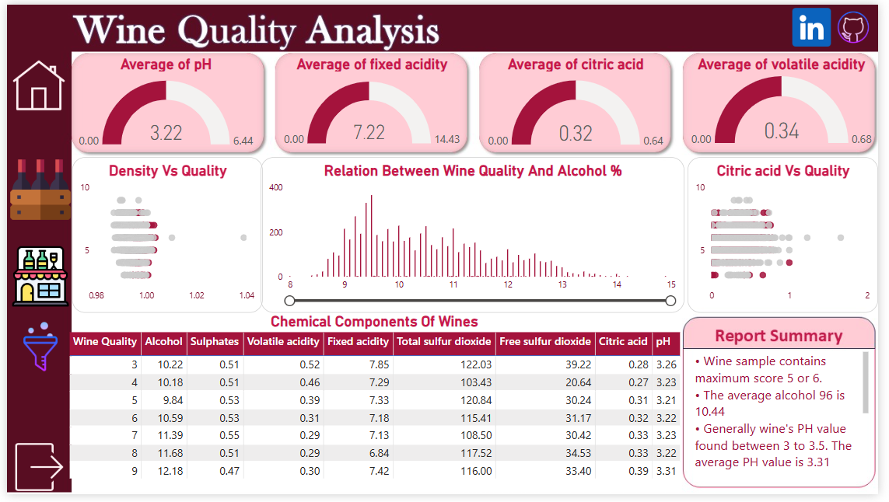

# 🍷 Wine Quality Prediction

## 📌 Project Overview  
The *Wine Quality Prediction* project aims to analyze the quality of wine (both red and white) based on its chemical composition using *Machine Learning* models. This project includes **data preprocessing, model training, evaluation, and visualization** in *Power BI*.

---

## 📂 Folder Structure  
```
Wine-Quality-Prediction
├── data                  # Contains datasets (CSV files)
│   ├── wine-quality-white-and-red.csv
│   ├── images.csv
│
├── notebooks             # Jupyter/Colab notebooks for data exploration & model training
│   ├── WineQuality.ipynb
│
├── src                   # Python scripts for preprocessing & model training
│   ├── app.py
│   └── templates
│       └── index.html
│
├── models                # Saved trained models
│   ├── wine_quality_pipeline.pkl
│   ├── best_wine_model.pkl
│
├── docs                  # Project documentation
│   ├── report.pdf
│
├── Images                # Power BI & UI screenshots
│   ├── index.png
│   ├── overview.png
│   ├── analysis.png
│   ├── html_ui.png
│
├── README.md             # Project description
├── requirements.txt      # Required Python libraries
├── LICENSE               # Open-source license
```

---

## 📊 Dataset Information  
- **Dataset Source:** [Kaggle - Wine Quality Dataset](https://www.kaggle.com/datasets/ruthgn/wine-quality-data-set-red-white-wine/data)  
- **Data Description:** Contains physicochemical tests of *red and white wine samples* along with quality ratings.  
- **Target Variable:** `quality` (ranges from 0–10, representing wine quality)  
- **Features:**
  - fixed acidity
  - volatile acidity
  - citric acid
  - type
  - residual sugar
  - chlorides
  - free sulfur dioxide
  - total sulfur dioxide
  - density
  - pH
  - sulphates
  - alcohol

---

## 📌 Implementation Steps

### 1️⃣ Data Preprocessing  
- Handling Missing Values (if any)  
- Feature Scaling using `StandardScaler`  
- Splitting Data into training and testing sets  
- Encoding Target Variable (Converting into classification problem)  

### 2️⃣ Model Training  
We implemented **5 ML models**:
- 🌳 Random Forest  
- 🔍 K-Nearest Neighbors (KNN)  
- 🌿 Decision Tree  
- 📈 Gradient Boosting  
- 🏹 Support Vector Classifier (SVC)  

### 3️⃣ Model Evaluation  
- Accuracy Score  
- Precision, Recall, and F1-Score  
- Confusion Matrix & ROC Curve  
- Power BI Visualizations 📊  

### 4️⃣ Power BI Dashboard  
- **Index Page:** Dataset summary & wine distribution  
- **Overview Page:** Data preprocessing & feature importance  
- **Analysis Page:** Model performance comparison  

---

## 🚀 Live Preview  
- **Power BI Dashboard:** [Click Here](https://app.powerbi.com/view?r=eyJrIjoiOTIwYWYyY2MtOTZiYS00MWUxLWI3NzgtMmFkYTFjMmZmMDZlIiwidCI6ImRhYTU5MmNhLWRlN2ItNGM1NC04ODM2LTkxYTY2OTBmZTE5NyJ9&pageName=dd74d0105ec518cb7330)  
- **Web UI:** [Redirect To Render](https://wine-quality-prediction-1-1fuo.onrender.com)

---

## 📸 Power BI Dashboard (Screenshots)

### 📋 Index Page  


### 🧪 Overview Page  


### 📈 Analysis Page  


### 🌐 HTML UI  


---

## 📊 Dashboard Sections

### 📋 Index Page  
Provides an overall summary of the wine dataset and distribution, including:
- Total number of wine samples (red & white)  
- Distribution of wine quality  
- Summary statistics of key features  
- Correlation between wine properties  
- Percentage of wine types in the dataset  

---

### 🔍 Overview Page  
Focuses on data preprocessing and feature importance:
- Feature engineering techniques  
- Feature importance in prediction  
- Feature distribution across quality levels  
- Outlier detection and handling  
- Data transformation methods  

---

### 📈 Analysis Page  
Covers model performance details:
- Accuracy, precision, recall, F1-score comparison  
- Confusion matrices  
- ROC curves & AUC scores  
- Separate metrics for red & white wine  
- Hyperparameters & optimization techniques  

---

## 🧠 Source Code – `src` Folder

### `app.py`  
The Flask-based web app for prediction:
- Loads trained ML models  
- Exposes API endpoints  
- Offers UI for input & results  
- Supports red & white wine predictions  
- Returns confidence scores  
- Includes validation & error handling  
- Swagger documentation enabled  

---

## 🛠 Requirements

All required libraries are listed in `requirements.txt`:

```
Flask==2.0.3
Werkzeug==2.0.3
gunicorn==20.1.0
joblib==1.2.0
numpy==1.23.5
pandas==1.5.3
scikit-learn==1.4.2
matplotlib==3.6.2
seaborn==0.12.2
```

📦 Install using:

```bash
pip install -r requirements.txt
```

---

## 📤 GitHub Submission Steps

1. Create a GitHub repository and **push all files**  
2. Write meaningful **commit messages**  
3. Include `README.md`, `requirements.txt`, and `LICENSE`  
4. Attach the **Power BI report (PDF/Markdown)**  
5. Share the **GitHub link** before the deadline  

---

## 🔄 How to Clone This Repository

```bash
# 1. Open Terminal
# 2. Run the clone command
git clone https://github.com/<your-username>/Wine-Quality-Prediction.git

# 3. Navigate to the project folder
cd Wine-Quality-Prediction

# 4. Install dependencies
pip install -r requirements.txt

# 5. Run the application
# Local:
python src/app.py

# Deployment (Render/Gunicorn):
gunicorn --bind 0.0.0.0:$PORT src.app:app
```

---

## 📌 Contact Information

📧 Email: [aeshaprajapati2212@gmail.com](mailto:aeshaprajapati2212@gmail.com)  
🔗 LinkedIn: [Aesha Prajapati](https://www.linkedin.com/in/aeshaprajapati12)

---

## 📜 License

This project is open-source under the **Apache License**.

---

✅ *If you found this useful, give it a ⭐ on GitHub!* 🚀

---
